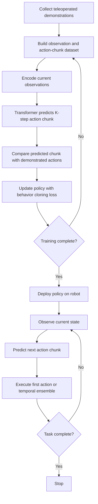

<!-- Generated by scripts/generate_docs.py. Do not edit directly. -->

# ACT

Imitation learning policy that predicts action chunks with a transformer and executes them over short horizons.

  Learning
  imitation learning, transformers, action chunking
  Mermaid

## Flowchart

## Formulas

### Behavior cloning objective

$$
\mathcal{L}_{\text{BC}} = \mathbb{E}_{(o_t, a_{t:t+K-1})}\!\left[\left\lVert \hat{a}_{t:t+K-1} - a_{t:t+K-1}\right\rVert_1\right]
$$

### Chunked policy

$$
\hat{a}_{t:t+K-1} = \pi_\theta(o_t, z)
$$

## Notes

- ACT stands for Action Chunking with Transformers.
- Predicting several future actions at once reduces compounding error and allows smoother closed-loop execution.
- A latent variable or encoder can model demonstration variability when multiple valid action chunks exist.

[Back to homepage](../index.md){ .md-button .md-button--primary }
