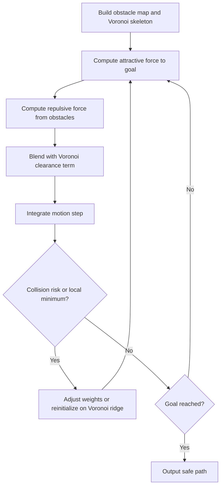

<!-- Generated by scripts/generate_docs.py. Do not edit directly. -->

# APF (Voronoi)

Potential-field planning that blends goal attraction, obstacle repulsion, and Voronoi-based clearance guidance.

  Planning
  potential fields, voronoi, obstacle avoidance
  Mermaid

## Flowchart

## Notes

- The Voronoi term encourages paths with larger obstacle clearance.
- It helps reduce the local-minimum issues of plain artificial potential fields.

[Back to homepage](../index.md){ .md-button .md-button--primary }
