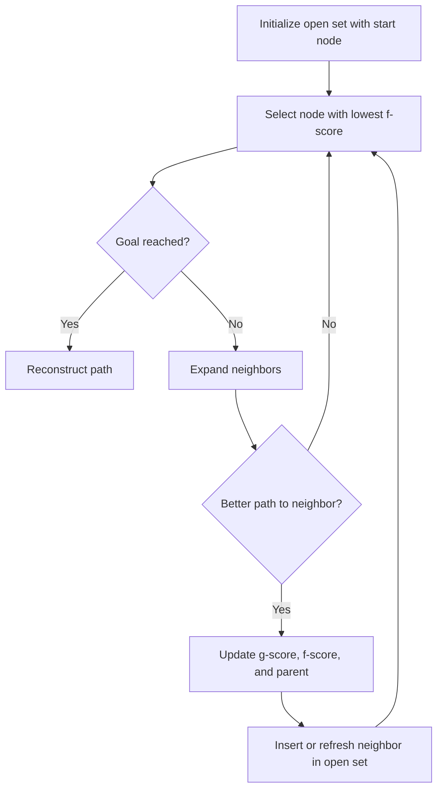

<!-- Generated by scripts/generate_docs.py. Do not edit directly. -->

# A*

Heuristic pathfinding that expands the frontier node with the lowest estimated total cost.

  Search
  pathfinding, heuristic, graph
  Mermaid

## Flowchart

## Notes

- Uses f(n) = g(n) + h(n) to rank candidates.
- With an admissible heuristic, A* returns an optimal shortest path.

[Back to homepage](../index.md){ .md-button .md-button--primary }
