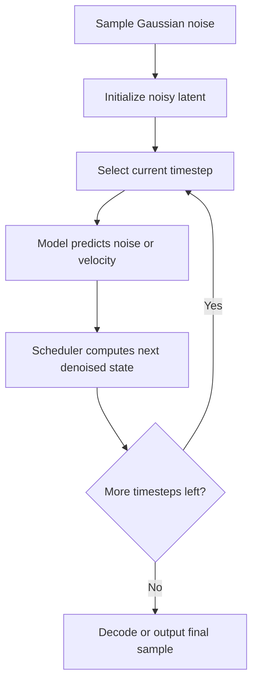

<!-- Generated by scripts/generate_docs.py. Do not edit directly. -->

# Diffusion

Generative sampling process that starts from noise and iteratively denoises toward a final sample.

  Generative Models
  generative ai, denoising, iterative sampling
  Mermaid

## Flowchart

## Formulas

### Forward noising

$$
q(x_t \mid x_0) = \mathcal{N}\!\left(x_t; \sqrt{\bar{\alpha}_t}\,x_0,\; (1-\bar{\alpha}_t)\mathbf{I}\right)
$$

### Training objective

$$
\mathcal{L}_{\text{simple}} = \mathbb{E}_{x_0,\epsilon,t}\!\left[\left\lVert \epsilon - \epsilon_\theta(x_t, t)\right\rVert_2^2\right]
$$

### Reverse update

$$
x_{t-1} = \text{SchedulerStep}\!\left(x_t,\; \epsilon_\theta(x_t, t),\; t\right)
$$

## Notes

- The model predicts noise, velocity, or a related residual at each timestep.
- A scheduler maps the prediction into the next, less noisy latent state.

[Back to homepage](../index.md){ .md-button .md-button--primary }
