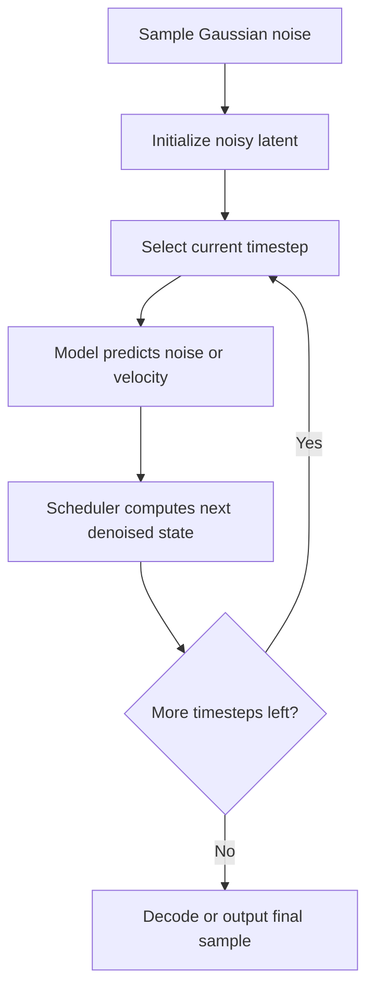

<!-- Generated by scripts/generate_docs.py. Do not edit directly. -->

# Diffusion

Generative sampling process that starts from noise and iteratively denoises toward a final sample.

  Generative Models
  generative ai, denoising, iterative sampling
  Mermaid

## Flowchart

## Notes

- The model predicts noise, velocity, or a related residual at each timestep.
- A scheduler maps the prediction into the next, less noisy latent state.

[Back to homepage](../index.md){ .md-button .md-button--primary }
