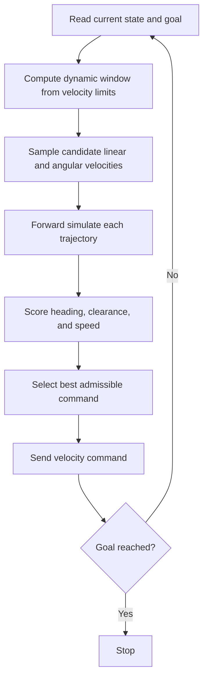

<!-- Generated by scripts/generate_docs.py. Do not edit directly. -->

# DWA

Local planner that samples admissible velocity commands inside a dynamic window and scores short rollouts.

  Local Planning
  velocity sampling, mobile robots, local planner
  Mermaid

## Flowchart

## Notes

- DWA evaluates heading, clearance, and speed over short simulated trajectories.
- It is most effective when paired with a higher-level global planner.

[Back to homepage](../index.md){ .md-button .md-button--primary }
