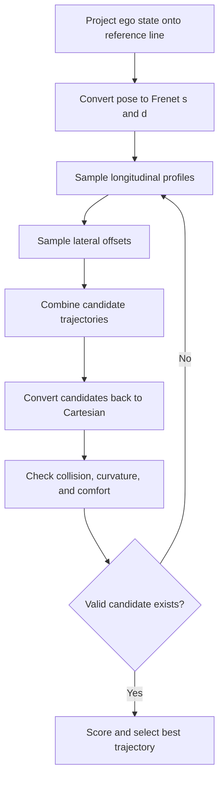

<!-- Generated by scripts/generate_docs.py. Do not edit directly. -->

# Frenet Frame

Road-aligned planning that samples trajectories in longitudinal and lateral coordinates along a reference line.

  Planning
  road planning, curvilinear coordinates, trajectory generation
  Mermaid

## Flowchart

## Notes

- Frenet coordinates decouple progress along the road from lateral offset.
- Candidate trajectories are usually scored on safety, comfort, and progress.

[Back to homepage](../index.md){ .md-button .md-button--primary }
