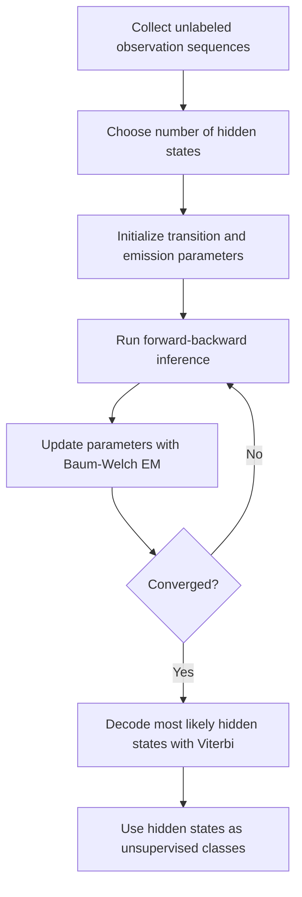

<!-- Generated by scripts/generate_docs.py. Do not edit directly. -->

# HMM Unsupervised Classification

Hidden Markov model that learns latent state classes from unlabeled sequences with Baum-Welch EM.

  Machine Learning
  hmm, unsupervised learning, sequence classification
  Mermaid

## Flowchart

## Formulas

### Joint sequence likelihood

$$
p(x_{1:T}, z_{1:T}) = p(z_1)\prod_{t=2}^{T}p(z_t \mid z_{t-1})\prod_{t=1}^{T}p(x_t \mid z_t)
$$

### EM objective

$$
\theta^{*} = \arg\max_{\theta}\sum_n \log p_{\theta}(x^{(n)}_{1:T_n})
$$

## Notes

- Baum-Welch estimates transition and emission parameters without labeled states.
- Viterbi decoding converts the learned latent states into a discrete class sequence.

[Back to homepage](../index.md){ .md-button .md-button--primary }
