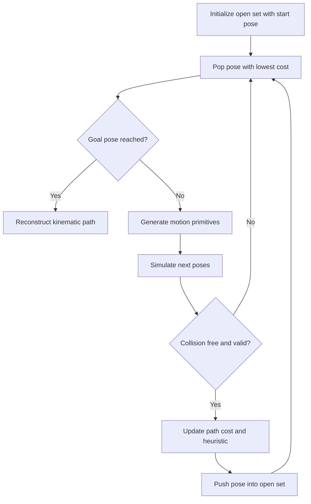

<!-- Generated by scripts/generate_docs.py. Do not edit directly. -->

# Hybrid A*

Kinematically aware search that expands continuous poses with motion primitives and heuristic guidance.

  Planning
  search, nonholonomic, path planning
  Mermaid

## Flowchart

## Notes

- Hybrid A* keeps a grid-based heuristic while expanding continuous vehicle states.
- It is widely used for car-like parking and low-speed maneuvering.

[Back to homepage](../index.md){ .md-button .md-button--primary }
