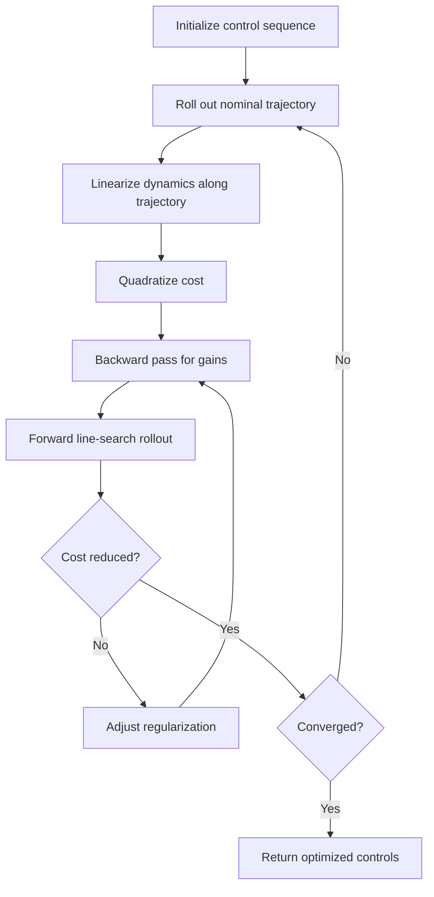

<!-- Generated by scripts/generate_docs.py. Do not edit directly. -->

# iLQR

Iterative optimal control that linearizes dynamics and quadratizes cost around a nominal trajectory.

  Control
  optimal control, nonlinear optimization, trajectory optimization
  Mermaid

## Flowchart

## Notes

- iLQR alternates a backward pass for feedback gains with a forward rollout.
- Regularization is often used when the local quadratic model is ill-conditioned.

[Back to homepage](../index.md){ .md-button .md-button--primary }
