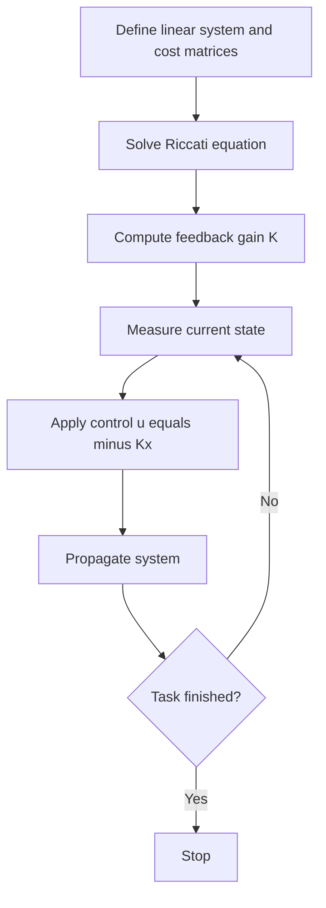

<!-- Generated by scripts/generate_docs.py. Do not edit directly. -->

# LQR

State-feedback control that minimizes a quadratic cost for a linear dynamical system.

  Control
  feedback control, optimal control, linear systems
  Mermaid

## Flowchart

## Notes

- Infinite-horizon LQR uses the algebraic Riccati equation.
- The feedback law is linear in the state and often written as u = -Kx.

[Back to homepage](../index.md){ .md-button .md-button--primary }
