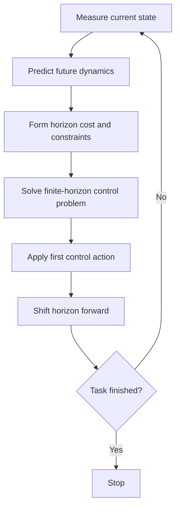

<!-- Generated by scripts/generate_docs.py. Do not edit directly. -->

# MPC

Receding-horizon control that repeatedly solves a constrained finite-horizon optimization problem.

  Control
  predictive control, constrained optimization, receding horizon
  Mermaid

## Flowchart

## Notes

- MPC applies only the first optimized action before re-solving at the next step.
- It handles multi-variable systems and explicit constraints naturally.

[Back to homepage](../index.md){ .md-button .md-button--primary }
