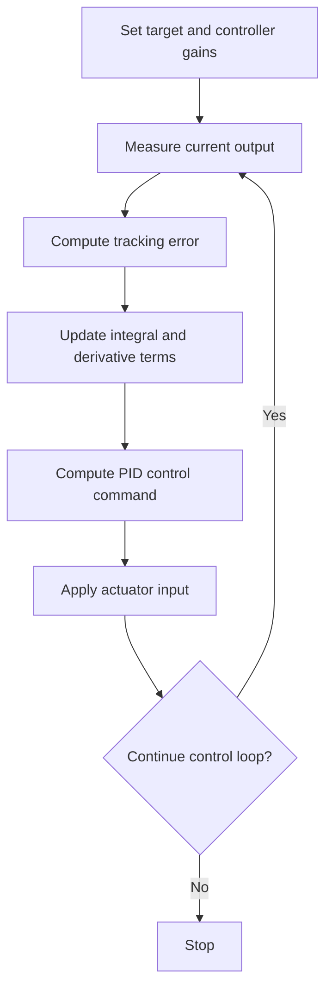

<!-- Generated by scripts/generate_docs.py. Do not edit directly. -->

# PID

Classical feedback controller that combines proportional, integral, and derivative error terms.

  Control
  feedback control, tracking, classical control
  Mermaid

## Flowchart

## Notes

- Integral action removes steady-state error when the loop is well tuned.
- Derivative action can improve damping but is sensitive to noise.

[Back to homepage](../index.md){ .md-button .md-button--primary }
