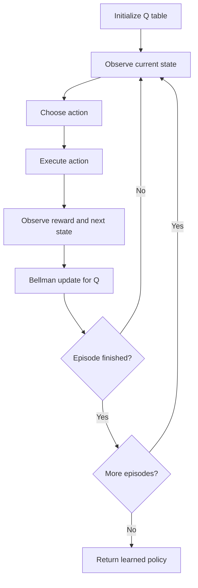

<!-- Generated by scripts/generate_docs.py. Do not edit directly. -->

# Q-learning

Model-free reinforcement learning that updates action values with the Bellman optimality target.

  Reinforcement Learning
  rl, value iteration, tabular
  Mermaid

## Flowchart

## Notes

- Often paired with epsilon-greedy exploration.
- Repeated Bellman updates drive Q-values toward the optimal action-value function.

[Back to homepage](../index.md){ .md-button .md-button--primary }
