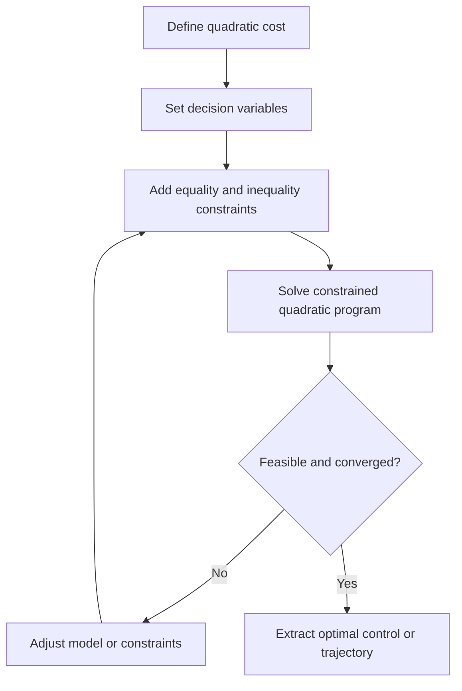

<!-- Generated by scripts/generate_docs.py. Do not edit directly. -->

# QP

Constrained optimization that minimizes a quadratic objective under linear equality and inequality constraints.

  Optimization
  quadratic programming, convex optimization, constrained control
  Mermaid

## Flowchart

## Notes

- A positive semidefinite Hessian yields a convex problem.
- QP is commonly used for trajectory smoothing, allocation, and MPC subproblems.

[Back to homepage](../index.md){ .md-button .md-button--primary }
