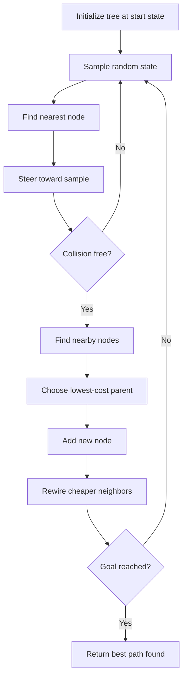

<!-- Generated by scripts/generate_docs.py. Do not edit directly. -->

# RRT*

Sampling-based planner that rewires the tree to improve path cost and achieve asymptotic optimality.

  Planning
  robotics, motion planning, optimal planning
  Mermaid

## Flowchart

## Notes

- RRT* extends RRT with near-neighbor parent selection and rewiring.
- Solution quality improves as the number of samples increases.

[Back to homepage](../index.md){ .md-button .md-button--primary }
