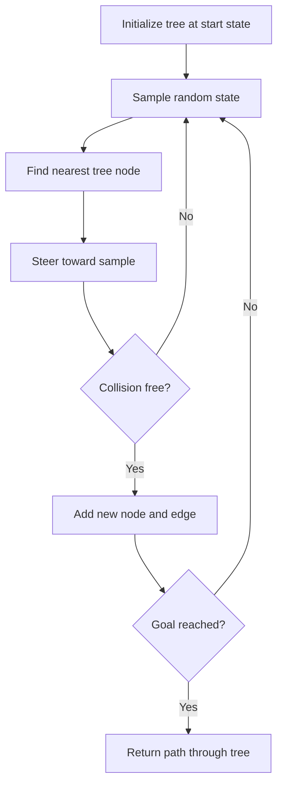

<!-- Generated by scripts/generate_docs.py. Do not edit directly. -->

# RRT

Sampling-based motion planning that incrementally grows a tree toward random states.

  Planning
  robotics, motion planning, sampling
  Mermaid

## Flowchart

## Notes

- RRT is effective in high-dimensional continuous spaces.
- Collision checking is usually the dominant practical cost.

[Back to homepage](../index.md){ .md-button .md-button--primary }
