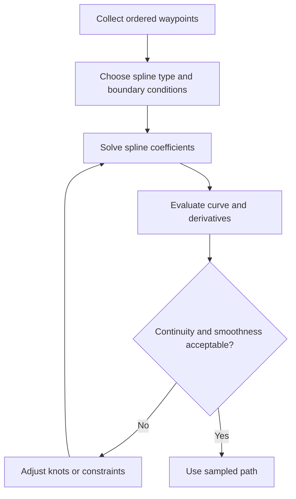

<!-- Generated by scripts/generate_docs.py. Do not edit directly. -->

# Spline

Piecewise polynomial interpolation that creates a smooth curve through ordered waypoints.

  Geometry
  interpolation, smoothing, path generation
  Mermaid

## Flowchart

## Notes

- Cubic splines are a common default because they balance smoothness and simplicity.
- Boundary conditions determine endpoint derivatives and overall shape.

[Back to homepage](../index.md){ .md-button .md-button--primary }
